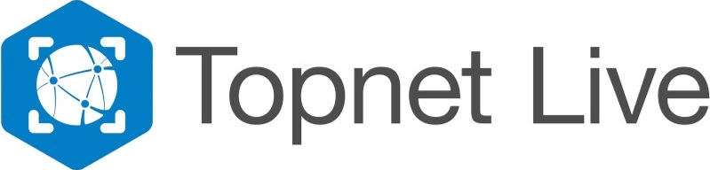

  
# Using Septentrio's Receiver and Topcon TopNet live correction services for precise positioning

## GENERAL CONTEXT OF THIS GUIDE

GNSS (Global Navigation Satellite System) technology has changed the way we navigate and position ourselves, with applications in various industries including transportation, surveying and agriculture. However, atmospheric conditions and signal blockages can affect the accuracy of GNSS location information. 

GNSS corrections are used to mitigate these effects and improve the accuracy of position measurements. In recent years, there has been a growing demand for high-accuracy positioning, which has led to the evolution of GNSS correction mechanisms such as OSR, SSR or LBand delivery. Standardization is not yet established, making it challenging for users to access and use these corrections. 

To address this challenge, it is useful to create an ecosystem around GNSS corrections that is agnostic. This repository is part of a set of guides and documentation and explores a way of running Topcon corrections on your system quickly. Making it easy for users/integrators to evaluate and access these service. Platforms like Github enable documentation and the creation of demonstrators to allow users to try out different correction services with ease.

| <a href="https://github.com/septentrio-gnss/Septentrio_AgnosticCorrectionsProgram#set-up-guide-to-use-third-party-osr-and-ssr-correction-services-with-septentrios-receivers-for-precise-positioning">To access the GitHub homepage to which this guide belongs, click here</a>|
|---|

## AUTHORS
  
| Name | GitHub |
|------|--------|
| Arno Balois | <a href="https://github.com/Arno-Balois">Arno-Balois</a>   |    

## MAINTAINER
  
| GitHub |
|--------|
| <a href="https://github.com/septentrio-users">septentrio-users</a>   |    

## DO YOU HAVE ANY QUESTIONS? CONTACT SEPTENTRIO SUPPORT TEAM

| <a href="https://web.septentrio.com/GH-SSN-support ">Septentrio Support Page</a>|
|---|

## SEPTENTRIO LINKS FOR USERS
 
| Contact                                                                          | Septentrio Home Page                                                        |
|----------------------------------------------------------------------------------|-----------------------------------------------------------------------------|
| <a href="https://web.septentrio.com/GH-SSN-contact ">Septentrio Contact Page</a> | <a href="https://web.septentrio.com/SKY-SSN-home">Septentrio Home Page</a> |

## DISCLAIMER
  
This set of guidelines consist of a several practical examples to help Septentrio Module users and developers to integrate third party GNSS corrections. The guidelines are based on a concrete setup, which you may or may not use to follow the integration guidelines.

It is desirable to mention the disclaimer about that setup and the guides in general before starting reading this guide.
  
| <a href="https://github.com/septentrio-gnss/Septentrio_AgnosticCorrectionsProgram/tree/main/Receiver%20and%20Raspberry%20Setup#disclaimer">Click here to know more about the Setup in which these guides are based and general implementation documentation disclaimer</a> |
|---|

## TABLE OF CONTENTS

<!--ts-->

* [Introduction](#introduction)
* [Who is Topcon Positioning?](#who-is-topcon-navigation)
* [What is Topnet Live?](#what-is-topnet-live)
* [Is the project Open Source?](#is-the-project-open-source)
* [Option 1: Using Topnet Live with NTRIP on board the receiver](#option-1-using-topnet-live-with-ntrip-on-board-the-receiver)
* [Option 2: Using Topnet Live with NTRIP client running in a Raspberry Pi](#option-2-using-topnet-live-with-ntrip-client-running-in-a-raspberry-pi)
   * [Receiver and Raspberry Pi Setup](#receiver-and-raspberry-pi-setup)
   * [str2str tool and RTKLIB installation](#str2str-tool-and-rtklib-installation)
      * [What are RTKLIB and str2str?](#what-are-rtklib-and-str2str)
      * [Tool installation](#tool-installation)
   * [Running Topnet service and str2str tool](#running-topnet-live-service-and-str2str-tool)

<!--te-->

## INTRODUCTION

This repository consists in a how-to guide for the implementation of a system that uses a Raspberry Pi 4 Model B in combination with a Septentrio Module to obtain Topcon corrections (TopNet services) for precise positioning. In this practical example case, mosaic-X5's Mosaic-Go Evaluation Kit is used, but any other Septentrio works in the same way if its connected with a USB cable. If you want to know more about or different modules and products you can visit us in: 

| <a href="https://web.septentrio.com/TOP-SSN-RX">Click here to the access to the all Septentrio GNSS Modules page.</a> |
|---|
   

Topcon's TopNET Live is a **NTRIP protocol** based service.

| <a href="https://www.topconpositioning.com/solutions/technology/infrastructure-software-and-services/gnss-correction-services?utm_source=Septentrio">Click here to navigate to Official Topcon's Topnet Live Service Web Page.</a> |
|---|
   

If you have any questions or feedback, please don't hesitate to reach out to us at <a href="https://web.septentrio.com/GH-SSN-support">Septentrio support page.</a>

## WHO IS Topcon Positioning?

    

Topcon Corporation is a Japanese multinational company that specializes in the design and manufacture of optical, surveying, and geolocation end user equipment. The company was founded in 1932 and is headquartered in Tokyo, Japan. Topcon's products and services are used in various industries, including construction, agriculture, healthcare, and geospatial applications.

## What is TOPNET Live?

    

TopNET Live is a real-time GNSS (Global Navigation Satellite System) correction service offered by Topcon Positioning Systems, a division of Topcon Corporation. TopNET Live is designed to provide high-precision positioning data to GNSS users in various industries, including surveying, construction, agriculture, and more.

Today only the RealPointservice (OSR services - RTK over NTRIP) from TopnetLive are supported with Septentrio receivers.

To know more about the service you can visit the following official web pages:

  
    
| <a href="https://www.topconpositioning.com/solutions/technology/infrastructure-software-and-services/gnss-correction-services?utm_source=Septentrio">Topcon's official Topnet Link web page</a> |
|---|
   
| <a href="">Click here to sign up to Topnet Live services now.</a> |
|---|
          

## IS THE PROJECT OPEN SOURCE?
This implementation guide for the Topnet Link correction services offered by Topcon is open-source. That is, this repository does not contain any code created or modified by us, but is a guide to using the RTKLIB library or other techniques such as sharing the internet via USB cable from the Rapsberry Pi to the Septentrio receiver. Therefore, this guide could be modified thanks to the feedback of the users who use it, so you are welcome to leave us your opinion or suggestions for improvement.

## Option 1: Using Topnet Live with NTRIP on board the receiver
Topnet Live works over NTRIP. Luckily all Septentrio receivers support NTRIP and have an NTRIP client embedded in the GNSS receiver. This can be accessed via the web-user interface. 

A guide on how to use NTRIP in Septentrio receivers can be found here:

    
| <a href="https://customersupport.septentrio.com/s/article/How-to-receive-corrections-via-NTRIP"> Click here to see how to use NTRIP with Septentrio receivers.</a> |
|---|
    

The mosaic receiver will need access to internet access in order to work properly. 
If connected to a PC you can enable internet access using the following guide:

    
| <a href="https://customersupport.septentrio.com/s/article/Internet-Over-USB"> Click here to see how share internet access from your PC to the receiver.</a> |
|---|
    

The section below however make a setup of NTRIP using a Raspberry Pi setup which when together with the mosaic-go might alternatively use an NTRIP client running in the Raspberry Pi.

## Option 2: Using Topnet Live with NTRIP client running in a Raspberry Pi
This method can be handy in the following circumstances:
-When the user cannot share internet access from the processor to the mosaic-go in order to use NTRIP
-When the user prefers to use a standard Serial port from the receiver 

The instructions below try to mimic a customer CPU using in this case a Raspberry Pi.

### RECEIVER AND RASPBERRY PI SETUP

Besides using the NTRIP client embedded in the receiver, the implementation of this service is based and tested on a specific setup. This setup consists of two main elements and their wiring and peripherals. These elements are the Mosaic-Go Module evaluation kit and a Raspberry Pi 4 Model B. 

    
| <a href="https://github.com/septentrio-gnss/Septentrio_AgnosticCorrectionsProgram#set-up-guide-to-use-third-party-osr-and-ssr-corrections-with-septentrios-receivers-for-precise-positioning"> Click here to acces to our Set Up Guide to use Third Party OSR and SSR correction services with Septentrio's Receivers for precise positioning.</a> |
|---|
    

It is necessary to follow the instructions of the previous setup installation guide, to return to this point for the implementation of the Topcon's Topnet Live corrections service.

### STR2STR TOOL AND RTKLIB INSTALLATION

Once the setup described above has been installed, the next step is to install a RTKLIB's tool called str2str, to be able to receive corrections from Topnet Live NTRIP Server/Caster to send them to the receiver and for to receive NMEA:GGA Messages from the receiver to send them to Topnet Live NTRIP Server/Caster.

#### What are RTKLIB and str2str?

**RTKLIB:**

<a href="https://rtklib.com/">RTKLIB </a> is an open source program package for standard and precise positioning with GNSS (Global Navigation Satellite System). RTKLIB consists of a portable program library and several APs (application programs) utilizing the library. The Application Program we are going to use is str2str.

**str2str:**

<a href="https://manpages.debian.org/unstable/rtklib/str2str.1.en.html">str2str </a> is an Application Program that receives input data from a stream and divides and outputs them to one or multiple streams. The input stream can be serial, TCP client, TCP server, NTRIP client, or file. The output stream can also be serial, TCP client, TCP server, NTRIP server, or file.

This repository provides a solution for a specific case where the input stream is a corrections provider that uses NTRIP. In this case, you should have the information (host, stream, password, etc.) of the NTRIP connection of the Correction Service Provider.

#### TOOL INSTALLATION

For the installation of the str2str tool, please following the next guide:

    
| <a href="https://github.com/septentrio-gnss/Septentrio_AgnosticCorrectionsProgram/tree/main/str2str#how-to-use-rtklibs-str2str-tool-to-receive-corrections-from-ntrip-server-and-send-them-to-septentrio-receiver"> How to use RTKLIB's str2str tool to receive corrections from NTRIP Server and send them to Septentrio receiver</a> |
|---|
    

Once the installation of the str2str tool has been made, there is only one last step is missing, which is the execution of the tool with your NTRIP credentials and serial port configuration. This steps are show in <a href="https://github.com/septentrio-gnss/TopconCorrectionsWithSeptentrio#running-topnet-live-service-and-str2str-tool">next section</a>.

### Running Topnet Live service and str2str tool

Once the Receiver and Raspberry Pi setup and RTKLIB's str2str tool installation are done, the only step remaining is to execute the str2str tool as showed in the previous mentioned guide. Also, here is a generic example of the usage of str2str having NTRIP as an input source and Serial port as an output.

        
